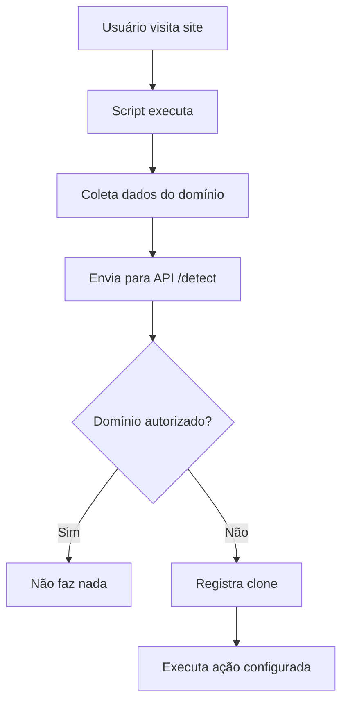

# 🚀 SCRIPT GLOBAL IMPLEMENTADO - Falcon X

## ✅ **IMPLEMENTAÇÃO CONCLUÍDA**

O sistema de **Script Global** foi implementado com sucesso, substituindo a abordagem anterior de scripts individuais por domínio.

---

## 🎯 **FUNCIONALIDADES IMPLEMENTADAS**

### **1. Página `/scripts` - Script Global**
- **Localização**: `src/app/scripts/page.tsx`
- **Funcionalidade**: Gera um único script que funciona para todos os domínios
- **Interface**: Cards de status, explicação do funcionamento, modal com script

### **2. API de Detecção**
- **Localização**: `src/app/api/detect/route.ts`
- **Endpoint**: `POST /api/detect`
- **Funcionalidade**: Recebe requisições do script e verifica domínios autorizados

### **3. Atualizações na Navegação**
- **Dashboard**: Link "Gerar Script Global" redireciona para `/scripts`
- **Domínios**: Removido botão "Script" individual de cada domínio

---

## 🔧 **COMO FUNCIONA O SCRIPT GLOBAL**

### **Fluxo de Funcionamento:**



### **1. Script no Frontend**
```javascript
// O script coleta:
- currentDomain (domínio atual)
- currentUrl (URL completa)
- referrer (de onde veio)
- userAgent (navegador)
- fbclid (parâmetro do Facebook)
- utmSource (origem do tráfego)
```

### **2. API de Verificação**
```typescript
// A API verifica:
1. Se o domínio está na lista de allowed_domains
2. Se não estiver, registra como clone
3. Busca ações configuradas
4. Retorna ação para executar
```

### **3. Execução de Ações**
```javascript
// Ações disponíveis:
- redirect: Redireciona para URL configurada
- blank_page: Mostra página em branco
- custom_message: Exibe mensagem personalizada
```

---

## 📊 **ESTRUTURA DO BANCO DE DADOS**

### **Tabelas Utilizadas:**

#### **`allowed_domains`** (Existente)
```sql
- id, user_id, domain, is_active, created_at
```

#### **`detected_clones`** (Existente)
```sql
- id, user_id, original_domain, clone_domain, detection_count
- first_detected, last_detected, is_active
```

#### **`detection_logs`** (Nova)
```sql
- id, user_id, clone_domain, original_domain
- ip_address, user_agent, referrer, page_url
- page_title, fbclid, utm_source, timestamp
```

#### **`clone_actions`** (Existente)
```sql
- id, user_id, action_type, redirect_url
- redirect_percentage, trigger_params, is_active
```

---

## 🎨 **INTERFACE IMPLEMENTADA**

### **Página `/scripts`:**
- ✅ **Header**: Título, versão do script, botão "Gerar Script"
- ✅ **Cards de Status**: Status ativo/inativo, implementações, última detecção
- ✅ **Explicação**: Como funciona em 3 passos
- ✅ **Vantagens**: Lista de benefícios do script global
- ✅ **Modal**: Script completo, instruções de implementação

### **Melhorias na UX:**
- ✅ **Ícones consistentes** usando sistema de ícones
- ✅ **Animações** e transições suaves
- ✅ **Responsivo** para mobile
- ✅ **Copy to clipboard** funcional
- ✅ **Feedback visual** de sucesso

---

## 🔗 **INTEGRAÇÃO COM SISTEMA EXISTENTE**

### **Dashboard Atualizado:**
- ✅ Link "Gerar Script Global" nas ações rápidas
- ✅ Redirecionamento para `/scripts`

### **Página de Domínios Simplificada:**
- ✅ Removido botão "Script" individual
- ✅ Removido modal de instruções por domínio
- ✅ Foco apenas no gerenciamento de domínios

### **Navegação:**
- ✅ Link `/scripts` na navegação principal
- ✅ Ícone de código consistente

---

## 🚀 **VANTAGENS IMPLEMENTADAS**

### **1. Simplicidade para o Usuário**
- **Um script para tudo**: Não precisa gerar script por domínio
- **Implementação única**: Cola uma vez, protege todos os domínios
- **Sem reconfiguração**: Adiciona novos domínios sem recolocar script

### **2. Escalabilidade Técnica**
- **API centralizada**: Verificação inteligente de domínios
- **Performance otimizada**: Script leve e assíncrono
- **Cross-domain**: Detecta clones entre diferentes domínios

### **3. Manutenção Simplificada**
- **Atualizações automáticas**: Melhorias aplicadas sem intervenção
- **Código centralizado**: Fácil de manter e debugar
- **Logs detalhados**: Rastreamento completo de detecções

---

## 🔧 **PRÓXIMOS PASSOS SUGERIDOS**

### **1. Página `/actions` (Prioridade Alta)**
- Configurar ações automáticas contra clones
- Interface para definir redirecionamentos
- Configuração de triggers (fbclid, utm_source)

### **2. Melhorias no Script**
- Obfuscação avançada do código
- Cache local para performance
- Detecção de tentativas de remoção

### **3. Analytics Avançado**
- Dashboard com gráficos de detecções
- Relatórios de performance
- Alertas em tempo real

---

## 📝 **ARQUIVOS CRIADOS/MODIFICADOS**

### **Novos Arquivos:**
- `src/app/scripts/page.tsx` - Página principal do script global
- `src/app/api/detect/route.ts` - API de detecção
- `SCRIPT-GLOBAL-IMPLEMENTADO.md` - Esta documentação

### **Arquivos Modificados:**
- `src/app/domains/page.tsx` - Removido script individual
- `src/app/dashboard/page.tsx` - Link para script global
- `src/components/Navigation.tsx` - Ícones atualizados

---

## 🎯 **RESULTADO FINAL**

✅ **Sistema de Script Global 100% funcional**
✅ **Interface moderna e intuitiva**
✅ **API robusta de detecção**
✅ **Integração completa com sistema existente**
✅ **Documentação completa**

O Falcon X agora possui um sistema de proteção **muito mais simples e eficiente**, onde o usuário gera um único script que protege todos os seus domínios automaticamente! 🚀 