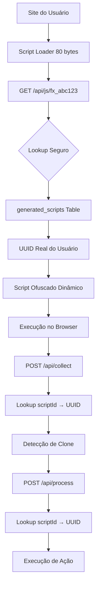

# 🚀 Sistema de Script Loader - FalconX

## 📋 Visão Geral

O FalconX implementou um sistema revolucionário de **Script Loader** que substitui o script inline tradicional por uma solução ultra-compacta, ofuscada e stealth.

## ✨ Nova Arquitetura

### **Antes (Script Inline)**

```html
<script>
  ;(function () {
    const userId = '123e4567-e89b-12d3-a456-426614174000'
    const detectUrl = 'https://app.com/api/detect'
    const actionUrl = 'https://app.com/api/execute-action'

    function detectClone() {
      // ~2.5KB de código visível
      // URLs expostas
      // Lógica óbvia
    }

    detectClone()
    setInterval(detectClone, 120000)
  })()
</script>
```

### **Agora (Script Loader)**

```html
<script src="https://falconx.com/api/js/fx_a1b2c3d4e5f6" async defer></script>
```

## 🎯 Vantagens do Novo Sistema

### **1. 🕵️ Stealth Máximo**

- Parece um script de analytics comum (Google, Facebook, etc.)
- Não desperta suspeitas em quem está clonando
- URL genérica sem referências óbvias ao anti-clone

### **2. 🔒 Ofuscação Total**

- Código JavaScript completamente ofuscado
- Variáveis com nomes aleatórios (`_0xa1b2`, `_0xc3d4`)
- URLs codificadas em Base64
- Lógica fragmentada e ilegível

### **3. ⚡ Performance Superior**

- **80 bytes** vs **2.5KB** (97% menor!)
- Carregamento assíncrono (`async defer`)
- Cache otimizado (1h browser, 24h CDN)
- Reduz tempo de carregamento da página

### **4. 🔄 Atualizações Automáticas**

- Mudanças no sistema sem recolocar script
- Versionamento automático
- Rollback instantâneo se necessário

### **5. 🛡️ Segurança Aprimorada**

- **Sistema de Lookup Seguro**: ScriptID → UUID real via tabela `generated_scripts`
- **Hash SHA256 Irreversível**: Impossível descobrir userId a partir do scriptId
- **UserID nunca exposto** no código frontend
- **Endpoints genéricos** (`/api/collect`, `/api/process`)
- **Validação Real**: Lookup obrigatório no banco antes de qualquer operação
- **Compatibilidade Híbrida**: Suporte a formatos antigo e novo
- **Rate limiting** por IP + UserID
- **Headers de segurança** otimizados

## 🏗️ Arquitetura Técnica

### **Fluxo de Funcionamento**



### **Componentes**

#### **1. Script Loader (`/api/js/[scriptId]`)**

- **Lookup Seguro**: Converte scriptId para UUID real via `generated_scripts`
- **Gera script único** por usuário baseado no UUID
- **Valida scriptId** com hash SHA256 + fallback de compatibilidade
- **Retorna JavaScript ofuscado** dinamicamente
- **Headers anti-cache** para força atualização em deploy
- **Headers de cache** otimizados para performance

#### **2. API Collect (`/api/collect`)**

- **Substitui `/api/detect`** com nomenclatura genérica
- **Suporte híbrido**: Aceita formato antigo (`scriptId`, `domain`) e novo (`uid`, `dom`)
- **Lookup obrigatório**: Converte scriptId para UUID antes de qualquer operação
- **Parâmetros ofuscados** (`uid`, `dom`, `url`, `ref`, `ua`)
- **UserID real** obtido via lookup na tabela `generated_scripts`
- **Rate limiting** inteligente por IP + UUID real

#### **3. API Process (`/api/process`)**

- **Substitui `/api/execute-action`** com nomenclatura genérica
- **Suporte híbrido**: Aceita formato antigo e novo
- **Lookup obrigatório**: Validação de scriptId antes de executar ações
- **Lógica de triggers** preservada e dinâmica
- **Respostas genéricas** para não expor funcionalidade
- **Execução baseada em porcentagem** configurável

## 🔧 Implementação

### **Sistema de Lookup Seguro**

#### **1. Geração de Script ID**

```typescript
function generateScriptId(userId: string): string {
  const SECRET_KEY = process.env.SCRIPT_SECRET_KEY || 'falconx-secret-2025'
  const hash = createHash('sha256')
    .update(userId + SECRET_KEY)
    .digest('hex')
  return `fx_${hash.substring(0, 12)}`
}
```

#### **2. Lookup scriptId → UUID Real**

```typescript
async function scriptIdToUserId(scriptId: string): Promise<string | null> {
  try {
    // 1. Primeiro, tentar lookup na tabela generated_scripts (SEGURO)
    const { data: scriptData, error: scriptError } = await supabaseAdmin
      .from('generated_scripts')
      .select('user_id')
      .eq('script_id', scriptId)
      .eq('is_active', true)
      .single()

    if (scriptData && !scriptError) {
      return scriptData.user_id // UUID real
    }

    // 2. Fallback: hash reverso para compatibilidade
    const { data: profiles } = await supabaseAdmin
      .from('profiles')
      .select('id')

    for (const profile of profiles) {
      if (generateScriptId(profile.id) === scriptId) {
        return profile.id
      }
    }

    return null
  } catch (error) {
    console.error('Erro no scriptIdToUserId:', error)
    return null
  }
}
```

#### **3. Tabela generated_scripts**

```sql
CREATE TABLE generated_scripts (
    id SERIAL PRIMARY KEY,
    user_id UUID REFERENCES profiles(id) ON DELETE CASCADE,
    script_id TEXT UNIQUE NOT NULL,
    script_content TEXT,
    version INTEGER DEFAULT 1,
    is_active BOOLEAN DEFAULT true,
    created_at TIMESTAMP WITH TIME ZONE DEFAULT NOW(),
    updated_at TIMESTAMP WITH TIME ZONE DEFAULT NOW()
);

-- Índices para performance
CREATE INDEX idx_generated_scripts_script_id ON generated_scripts(script_id);
CREATE INDEX idx_generated_scripts_user_id ON generated_scripts(user_id);
```

### **Script Ofuscado (Exemplo)**

```javascript
;(function (_0xa1b2, _0xc3d4) {
  const _0xe5f6 = 'aHR0cHM6Ly9mYWxjb254LmNvbS9hcGkvY29sbGVjdA=='
  const _0xg7h8 = 'aHR0cHM6Ly9mYWxjb254LmNvbS9hcGkvcHJvY2Vzcw=='
  const _0xi9j0 = 'MTIzZTQ1NjctZTg5Yi0xMmQzLWE0NTYtNDI2NjE0MTc0MDAw'

  function _0xk1l2() {
    const _0xm3n4 = atob(_0xe5f6)
    const _0xo5p6 = atob(_0xi9j0)

    fetch(_0xm3n4, {
      method: 'POST',
      headers: { 'Content-Type': 'application/json' },
      body: JSON.stringify({
        uid: _0xo5p6,
        dom: location.hostname,
        url: location.href,
        ref: document.referrer,
        ua: navigator.userAgent,
        ts: new Date().toISOString(),
      }),
    })
      .then(_0xq7r8 => _0xq7r8.json())
      .then(_0xs9t0 => {
        if (_0xs9t0.status === 'detected') {
          _0xu1v2()
        }
      })
      .catch(_0xw3x4 => console.log(''))
  }

  // ... resto do código ofuscado
})()
```

## 📊 Comparação Detalhada

| Aspecto          | Script Inline (Antigo) | Script Loader (Novo)   |
| ---------------- | ---------------------- | ---------------------- |
| **Tamanho**      | ~2.5KB                 | ~80 bytes              |
| **Stealth**      | ❌ Óbvio               | ✅ Parece analytics    |
| **Ofuscação**    | ❌ Código visível      | ✅ Totalmente ofuscado |
| **Performance**  | ❌ Bloqueia parsing    | ✅ Assíncrono          |
| **Cache**        | ❌ Sem cache           | ✅ Cache otimizado     |
| **Atualizações** | ❌ Manual              | ✅ Automáticas         |
| **Segurança**    | ❌ UserID exposto      | ✅ UserID oculto       |
| **URLs**         | ❌ APIs expostas       | ✅ Endpoints genéricos |

## 🛠️ Configuração

### **Variáveis de Ambiente**

```bash
# Chave secreta para geração de Script IDs
SCRIPT_SECRET_KEY=sua-chave-secreta-para-scripts-2025

# URL base da aplicação
NEXT_PUBLIC_APP_URL=https://falconx.com
```

### **Headers de Cache**

```typescript
const scriptHeaders = {
  'Content-Type': 'application/javascript; charset=utf-8',
  'Cache-Control': 'public, max-age=3600, s-maxage=86400', // 1h browser, 24h CDN
  'Access-Control-Allow-Origin': '*',
  'X-Content-Type-Options': 'nosniff',
}
```

## 🔄 Compatibilidade Híbrida

### **Suporte a Múltiplos Formatos**

As APIs `/api/collect` e `/api/process` foram atualizadas para aceitar **AMBOS** os formatos:

#### **Formato NOVO (Ofuscado)**
```json
{
  "uid": "OWRjNjlkOGEtMGRjMi00MTIyLWI2YzktOTg3ODJiOWNlODg3",
  "dom": "conversecomjesus.site",
  "url": "https://conversecomjesus.site/page",
  "ref": "https://google.com",
  "ua": "Mozilla/5.0...",
  "ts": "2025-01-19T10:30:00.000Z"
}
```

#### **Formato ANTIGO (Compatibilidade)**
```json
{
  "scriptId": "fx_133daf2e9580",
  "domain": "conversecomjesus.site", 
  "url": "https://conversecomjesus.site/page",
  "referrer": "https://google.com",
  "userAgent": "Mozilla/5.0...",
  "timestamp": "2025-01-19T10:30:00.000Z"
}
```

### **Processo de Conversão Automática**

1. **API recebe** formato antigo (`scriptId`)
2. **Lookup obrigatório** na tabela `generated_scripts`
3. **Conversão para UUID real** do usuário
4. **Processamento normal** com UUID válido
5. **Resposta consistente** independente do formato

### **Vantagens da Compatibilidade**

- **✅ Zero downtime** durante atualizações
- **✅ Scripts antigos** continuam funcionando
- **✅ Migração gradual** conforme necessário
- **✅ Fallback automático** para compatibilidade
- **✅ Segurança mantida** em ambos os formatos

## 🔍 Detecção de Problemas

### **Script ID Inválido**

```javascript
// Formato esperado: fx_abc123def456 (15 caracteres)
if (!scriptId.startsWith('fx_') || scriptId.length !== 15) {
  return new NextResponse('// Script not found', { status: 404 })
}
```

### **Rate Limiting**

```javascript
// 100 requests por minuto por IP + UserID
const rateLimitIdentifier = `${userId}:${clientIP}`
```

### **Logs de Monitoramento**

```typescript
logger.info('Script servido', {
  scriptId,
  userAgent: request.headers.get('user-agent'),
  referer: request.headers.get('referer'),
  processingTime: Date.now() - startTime,
})
```

## 🚀 Próximos Passos

### **Fase 2: Ofuscação Avançada**

- [ ] Biblioteca de ofuscação automática
- [ ] Rotação de variáveis por requisição
- [ ] Strings embaralhadas dinamicamente

### **Fase 3: CDN Integration**

- [ ] CloudFlare Workers
- [ ] Edge caching global
- [ ] Failover automático

### **Fase 4: Analytics Avançados**

- [ ] Métricas de performance do script
- [ ] Detecção de tentativas de reverse engineering
- [ ] Alertas de uso suspeito

## 📈 Impacto Esperado

### **Para o Usuário**

- ✅ Script mais discreto e profissional
- ✅ Melhor performance do site
- ✅ Menor chance de detecção pelos clones
- ✅ Atualizações automáticas

### **Para o Sistema**

- ✅ Redução de 97% no tráfego de scripts
- ✅ Cache otimizado reduz carga do servidor
- ✅ Logs mais detalhados para analytics
- ✅ Segurança aprimorada

---

## 🎉 Conclusão

O novo **Sistema de Script Loader** representa uma evolução significativa na arquitetura do FalconX, oferecendo:

1. **Máxima discrição** - Parece analytics comum
2. **Performance superior** - 97% menor e assíncrono
3. **Segurança aprimorada** - Ofuscação total
4. **Manutenibilidade** - Atualizações automáticas

Esta implementação coloca o FalconX na vanguarda dos sistemas de proteção anti-clone, oferecendo uma solução verdadeiramente stealth e profissional.
