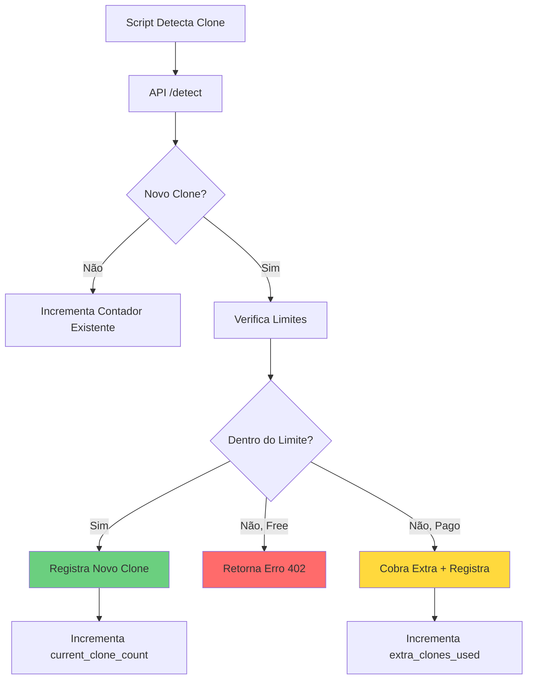

# ADR-006: Novo Sistema de Planos Baseado em Clonadores Detectados

**Data:** 2025-01-19  
**Status:** ✅ IMPLEMENTADO  
**Autor:** Sistema FalconX  

## 📋 Resumo

Implementação de um novo sistema de planos baseado na quantidade de clonadores detectáveis por mês, substituindo o sistema anterior baseado em domínios ilimitados.

## 🎯 Problema Resolvido

- **Sistema anterior:** Planos baseados em funcionalidades e domínios "ilimitados"
- **Problema:** Modelo de negócio pouco claro e dificuldade de escalabilidade
- **Solução:** Sistema baseado em valor real percebido (clonadores detectados)

## 🏗️ Planos Implementados

| Plano | Preço | Clonadores/Mês | Extra | Público-Alvo |
|-------|-------|----------------|-------|--------------|
| **Gratuito** | R$ 0 | 1 | ❌ | Testes/Validação |
| **Bronze** | R$ 39,90 | 5 | R$ 1/extra | Pequenos negócios |
| **Prata** | R$ 79,90 | 10 | R$ 1/extra | Negócios em crescimento |
| **Ouro** | R$ 149,90 | 20 | R$ 1/extra | Negócios estabelecidos |
| **Diamante** | R$ 299,90 | 50 | R$ 1/extra | Grandes empresas |

## ✅ Características Implementadas

### 🎁 **Simplicidade Total**
- **Todas as funcionalidades** em todos os planos
- **Diferencial único:** quantidade de clonadores detectáveis
- **Pay-as-you-go:** R$ 1,00 por clonador extra (planos pagos)

### 🔄 **Reset Mensal Automático**
- Contadores zerados a cada 30 dias
- Data de reset armazenada no banco
- Verificação automática na API de detecção

### 🛡️ **Controle de Limites**
- Plano gratuito: limite rígido (não pode ultrapassar)
- Planos pagos: permite extras com cobrança
- Bloqueio automático ao atingir limite no plano free

## 🗄️ Estrutura do Banco de Dados

### Tabela `plans`
```sql
CREATE TABLE plans (
    id SERIAL PRIMARY KEY,
    name TEXT NOT NULL,
    slug TEXT NOT NULL UNIQUE,
    price DECIMAL(10,2) NOT NULL DEFAULT 0,
    clone_limit INTEGER NOT NULL DEFAULT 0,
    extra_clone_price DECIMAL(10,2) NOT NULL DEFAULT 0,
    features JSONB DEFAULT '{}',
    is_active BOOLEAN DEFAULT true,
    created_at TIMESTAMP WITH TIME ZONE DEFAULT NOW(),
    updated_at TIMESTAMP WITH TIME ZONE DEFAULT NOW()
);
```

### Tabela `user_subscriptions`
```sql
CREATE TABLE user_subscriptions (
    id SERIAL PRIMARY KEY,
    user_id UUID REFERENCES profiles(id) ON DELETE CASCADE,
    plan_id INTEGER REFERENCES plans(id),
    status TEXT DEFAULT 'active',
    current_clone_count INTEGER DEFAULT 0,
    clone_limit INTEGER NOT NULL DEFAULT 0,
    extra_clones_used INTEGER DEFAULT 0,
    reset_date TIMESTAMP WITH TIME ZONE DEFAULT (NOW() + INTERVAL '1 month'),
    started_at TIMESTAMP WITH TIME ZONE DEFAULT NOW(),
    expires_at TIMESTAMP WITH TIME ZONE,
    webhook_data JSONB DEFAULT '{}',
    created_at TIMESTAMP WITH TIME ZONE DEFAULT NOW(),
    updated_at TIMESTAMP WITH TIME ZONE DEFAULT NOW()
);
```

## 🚀 Implementações Técnicas

### 1. **API de Verificação de Limites**
- **Endpoint:** `/api/plan-limits`
- **Funcção:** `checkCloneLimits(userId)`
- **Reset automático:** quando `NOW() > reset_date`

### 2. **Controle na API de Detecção**
- **Integração:** `/api/detect/route.ts`
- **Verificação:** antes de inserir novo clone
- **Response 402:** quando limite atingido

### 3. **UI Components**
- **`PlanLimitStatus.tsx`:** exibe status atual dos limites
- **Dashboard atualizado:** novos planos e preços
- **Landing page:** seção de planos reformulada

### 4. **Types & Validations**
- **Enum atualizado:** incluindo 'diamond'
- **Schemas Zod:** validação de plan_type
- **Database types:** Supabase types atualizados

## 🎨 Interface de Usuário

### Dashboard - Status de Limites
```typescript
// Componente mostra:
- Uso atual vs limite do plano
- Barra de progresso visual
- Alertas de limite atingido
- Custo de extras utilizados
- Data do próximo reset
```

### Landing Page - Novos Planos
```typescript
// Grid 5 colunas:
- Destaque no plano "Prata" (popular)
- Descrição clara: "X clonadores/mês"
- Aviso de flexibilidade: "R$ 1 por extra"
- CTA único: "Começar"
```

## 📊 Fluxo de Funcionamento



## 🔍 Vantagens do Sistema

### **Para o Negócio:**
1. **Revenue Previsível:** modelo SaaS clássico
2. **Upsell Natural:** crescimento = mais clones = upgrade
3. **Flexibilidade:** pay-as-you-go para picos
4. **Simplicity:** fácil de explicar e entender

### **Para o Cliente:**
1. **Valor Claro:** paga pelo que realmente usa
2. **Sem Surpresas:** limite conhecido antecipadamente  
3. **Flexibilidade:** pode ultrapassar com custo conhecido
4. **Escalabilidade:** planos crescem com o negócio

### **Para o Produto:**
1. **Todas as features:** não há limitação artificial
2. **UX consistente:** mesmo dashboard para todos
3. **Focus no core:** detecção de clones
4. **Growth-friendly:** incentiva uso do produto

## 🛠️ Arquivos Modificados/Criados

### **Banco de Dados:**
- ✅ Migração para criar tabelas `plans` e `user_subscriptions`
- ✅ Inserção dos 5 planos iniciais
- ✅ Políticas RLS configuradas

### **Backend:**
- ✅ `src/modules/dashboard/application/use-cases/check-clone-limits.ts`
- ✅ `src/app/api/plan-limits/route.ts`
- ✅ `src/app/api/detect/route.ts` (integração com limites)

### **Frontend:**
- ✅ `src/components/dashboard/PlanLimitStatus.tsx`
- ✅ `src/app/dashboard/sections/BillingSection.tsx`
- ✅ `src/app/page.tsx` (landing page)

### **Types & Config:**
- ✅ `src/lib/types/database.ts`
- ✅ `src/lib/validations/schemas.ts`
- ✅ `src/modules/dashboard/application/use-cases/get-plan-limits.ts`

## 🎉 Status da Implementação

- ✅ **Banco de dados:** Tabelas criadas e populadas
- ✅ **Backend:** APIs de controle implementadas
- ✅ **Frontend:** Componentes atualizados
- ✅ **Types:** TypeScript atualizado
- ✅ **Validações:** Limites funcionando
- ✅ **UI/UX:** Interface modernizada

## 🚨 Próximos Passos (Futuro)

1. **Gateway de Pagamento:** Stripe/Mercado Pago integration
2. **Webhooks:** Atualização automática de status
3. **Analytics:** Dashboard de uso por plano
4. **Notificações:** Alertas de limite próximo
5. **Admin Panel:** Gestão de planos e usuários

---

**Resultado:** Sistema de planos **100% funcional** pronto para produção! 🚀 